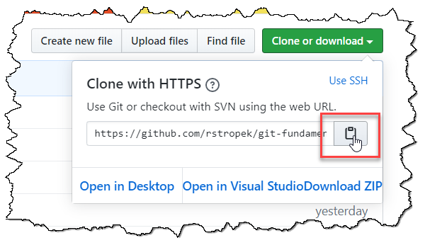

# Basic Commands

Getting started with basic Git commands


## Creating a Git repository

* Two options <!-- .element: class="fragment" -->
  * Start from scratch: `git init` ([ref](https://git-scm.com/docs/git-init))
  * Clone existing repository: `git clone <repository>` ([ref](https://git-scm.com/docs/git-clone))
* Folder <!-- .element: class="fragment" --> *.git*
  * Contains Git database
  * Don't delete or manipulate

 <!-- .element: class="fragment" -->


## Tips for New Repositories

* Get repository name from GitHub
  


## Tips for New Repositories

* Add <!-- .element: class="fragment" --> a *.gitignore* file ([ref](https://git-scm.com/docs/gitignore))
  * Add all files to ignore
  * Generate using [https://gitignore.io/](https://gitignore.io/)
* Add <!-- .element: class="fragment" --> a *readme.md* file
  * Describe the content of the repository using [Markdown](https://en.wikipedia.org/wiki/Markdown)
* Add <!-- .element: class="fragment" --> a *LICENSE.md* file
  * License for the content of your repository
  * Especially important for public repositories
  * [https://choosealicense.com/](https://choosealicense.com/) might be helpful
* Specify <!-- .element: class="fragment" --> folder name when cloning
  * Default: Repository name = folder name
  * Optional: Specify alternate folder name after repository (`git clone <repository> <folder>`)


## Aliases

* Alias = abbreviation for long Git commands ([ref](https://git-scm.com/book/en/v2/Git-Basics-Git-Aliases))
  * Tip: Google for *git must have aliases* to get suggestions

```bash
git config --global alias.cl clone
git cl https://github.com/rstropek/git-fundamentals.git
```


## Overview

| Git Command                                         | Description                                                             |
| --------------------------------------------------- | ----------------------------------------------------------------------- |
| [`status`](https://git-scm.com/docs/git-status)     | Displays paths/files that have differences (created, modified, deleted) |
| [`add`](https://git-scm.com/docs/git-add)           | Adds changes (creations, modifications, deletions) to staging area      |
| [`commit`](https://git-scm.com/docs/git-commit)     | Records changes from staging area to the repository                     |
| [`log`](https://git-scm.com/docs/git-log)           | Shows list of commits                                                   |
| [`diff`](https://git-scm.com/docs/git-diff)         | View changes                                                            |
| [`checkout`](https://git-scm.com/docs/git-checkout) | Restore files from a commit                                             |
| [`show`](https://git-scm.com/docs/git-show)         | Show content of a commit                                                |
| [`revert`](https://git-scm.com/docs/git-revert)     | Reverts changes of a commit                                             |


## `git status` ([ref](https://git-scm.com/docs/git-status))

* Displays paths/files that have differences (created, modified, deleted)
* Tip: Use `--short` flag to get a compact overview


